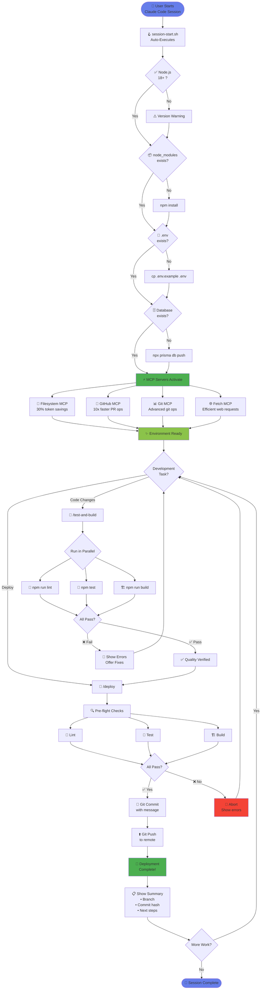
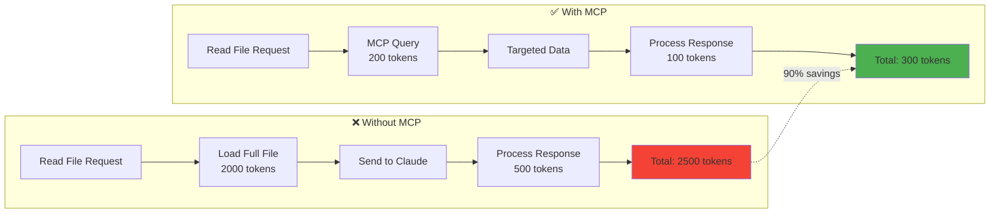
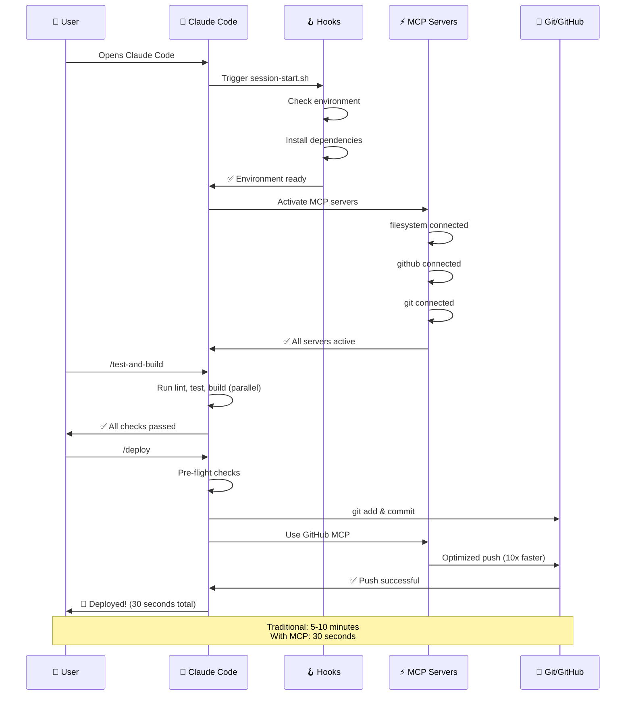
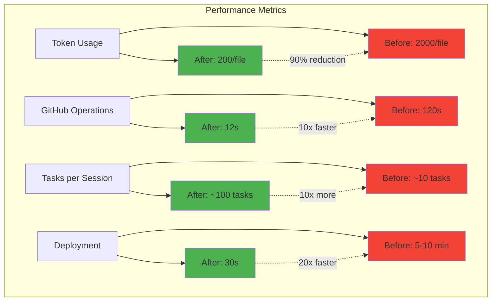
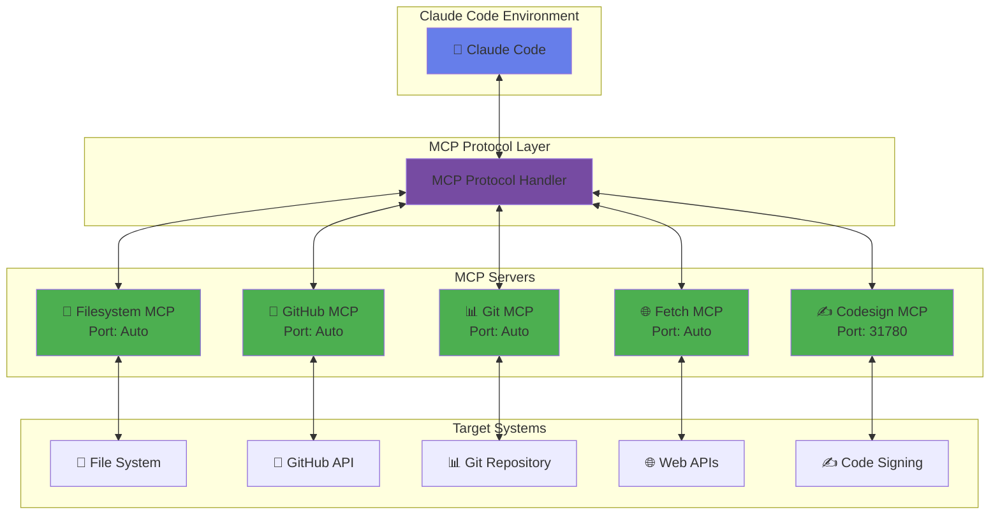

# 🎬 AgentGPT MCP Flow Diagrams

## 🌟 Interactive Animation

**Open this in your browser:** [MCP_FLOW_ANIMATION.html](./MCP_FLOW_ANIMATION.html)

Simply open the HTML file to see a fully animated, interactive visualization with:
- ✨ Auto-playing stage transitions
- 📊 Real-time token usage comparison
- 🎯 Performance metrics dashboard
- ⏯️ Playback controls

---

## 📊 Static Workflow Diagram



---

## 🔄 Token Optimization Flow



---

## 🚀 Deployment Pipeline



---

## 📊 Performance Comparison



---

## 🎯 MCP Server Architecture



---

## 🔧 How to View

### Interactive Animation (Recommended)

```bash
# Open in your default browser
open .claude/MCP_FLOW_ANIMATION.html

# Or on Linux
xdg-open .claude/MCP_FLOW_ANIMATION.html

# Or on Windows
start .claude/MCP_FLOW_ANIMATION.html
```

### View Mermaid Diagrams

These diagrams render automatically in:
- ✅ GitHub/GitLab (in README files)
- ✅ VS Code (with Mermaid extension)
- ✅ Obsidian, Notion, etc.
- ✅ Mermaid Live Editor: https://mermaid.live

---

## 📋 Diagram Legend

| Symbol | Meaning |
|--------|---------|
| 👤 | User action |
| 🤖 | Claude Code process |
| 🪝 | Automated hook |
| ⚡ | MCP server |
| 📁 | File operation |
| 🐙 | GitHub operation |
| 📊 | Git operation |
| 🌐 | Web/API operation |
| ✅ | Success state |
| ❌ | Error state |
| ⚠️ | Warning state |
| 💬 | Slash command |
| 🚀 | Deployment |

---

## 🎨 Color Coding

- **Purple/Blue** - User interface / Entry points
- **Green** - Active/Success states
- **Red** - Error/Abort states
- **Yellow** - Warning states
- **Gray** - Standard operations

---

## 📖 Understanding the Flow

### 1. **Session Start** (Stage 1)
- User opens Claude Code
- `session-start.sh` hook executes automatically
- Environment is validated and prepared
- MCP servers establish connections

### 2. **MCP Optimization** (Stage 2)
- Multiple MCP servers activate in parallel
- Each server provides specialized capabilities
- Token usage is reduced by 30-90%
- Operation speed increases by 2-10x

### 3. **Development Workflow** (Stage 3)
- Slash commands trigger automated workflows
- Quality checks run in parallel
- Fast feedback loop for developers
- Intelligent error handling and suggestions

### 4. **Deployment** (Stage 4)
- Pre-flight checks ensure code quality
- Automated git operations
- Push to remote with retry logic
- Deployment summary and next steps

---

## 🔄 Continuous Improvement

The flow is designed to:
- ⚡ **Minimize latency** - parallel operations
- 💾 **Reduce tokens** - MCP optimization
- 🎯 **Ensure quality** - automated checks
- 🚀 **Speed deployment** - one-command workflows
- 📊 **Provide visibility** - clear status and metrics

---

**Made with 💜 for efficient development**
